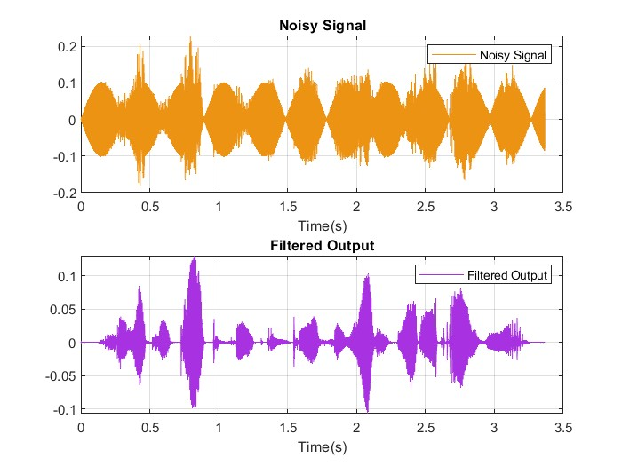
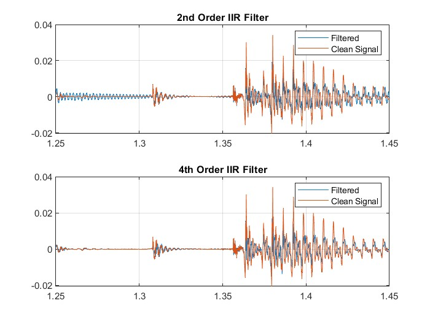
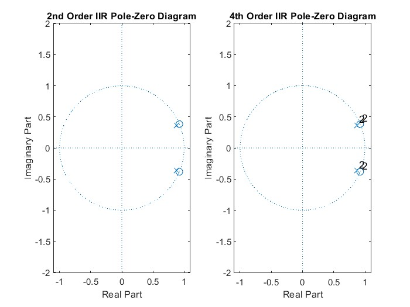

<h1>Audio Filtering Using IIR Notch Filter</h1>
The 2nd order IIR notch filter is able to filter tonal noise out of a audio file using transfer function (1). However, this filter leaves some audible residual noise in the output audio file due to narrow attenuation to to 500 Hz (the noise frequency). Thus, to more effectively filter the audio signal, the notch must include nearby frequencies as well.  

 

This can be achieved by utilizing filters of higher order. In this section, I was able to derive a 4th order notch filter that can achieve better filtering (in other words, a more rounded notch). The main idea is to have poles and zeros of greater multiplicities at the frequency we want to remove (500 Hz). Thus, in this case, we would square both the numerator (zeros) and denominator (poles) as seen in transfer function (2).  

 

Expanded out, this becomes (3), which I implent as coefficients in MATLAB. 
 

<h2>Results</h2>

    I was able to achieve better audio filtering with this 4th order filter. If you wish to listen to the difference, refer to the files in 'Audio/'.

    The 4th order IIR filter does a much better job of removing the tonal noise originally present, while the 2nd order IIR filter was able to only reduce it greatly. In other words, the 500 Hz noise is made inaudible using the 4th order filter. This is most clearly seen using a zoomed-in view of the output waveforms (below). 

 
The pole-zero diagram is as expected, there are poles and zeros of multiplicity 2 each.

